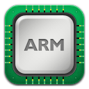
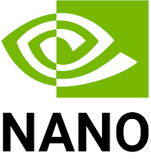

<h1 align="center">Hello! 👋, Thanks for visiting 😀 I hope you enjoy my project demo below the pinned repo 😊</h1>
<h3 align="center">Embedded/Robotics Software Engineer</h3>

- [Cal Poly Pomona](https://www.cpp.edu/) graduate as [Electronic System Engineering Technology](https://www.cpp.edu/engineering/et/eset/index.shtml) on May, 2023.

- In my free time, I like to get better at my career and do self learning from [Udemy](https://www.udemy.com/)

- Ask me about **Microcontroller, Embedded Systems, Robotics**

- How to reach me **christopherlazo3199@gmail.com**

<h3 align="left">Connect with me:</h3>

<h3 align="left">Skills, Languages, and Technologies</h3>

- Languages:

- Firmware:

  

 

